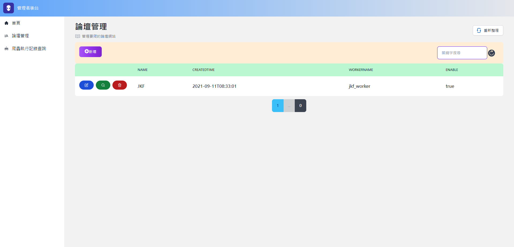
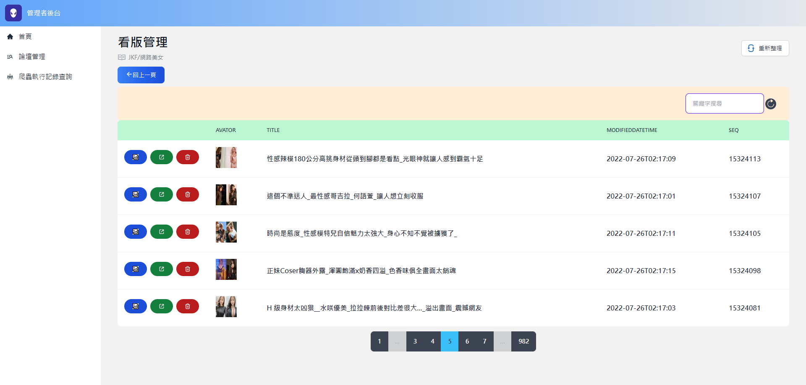
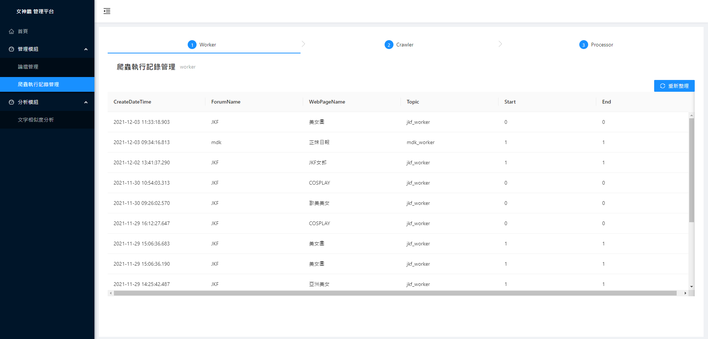

# 女神牆
> 營造一個下班舒壓的好所在
## ✨Features✨
- 透過web管理頁面執行論壇爬蟲作業
- 精美的女神流水牆
- 使用``dapr`` + ``keda``擴充和開發爬蟲作業程式
- 透過論壇文章標題相似度計算，找出更多相似的文章
## 🔥系統截圖🔥
- > 女神流水牆
<center></center>
<br/>

- > 管理者儀表板
<center></center>
<br/>

- > 論壇管理
<center></center>
<br/>

- > 文章管理
<center></center>
<br/>

- > 爬蟲執行記錄管理
<center></center>
<br/>

## 安裝開發工具
- [nodejs](https://nodejs.org/en/)
- [python3.9.x](https://www.python.org/downloads/release/python-399/)
- [dotnet6](https://dotnet.microsoft.com/download/dotnet/6.0)
- [visual studio code](https://code.visualstudio.com/)
- [docker](https://www.docker.com/)
- [minikube](https://minikube.sigs.k8s.io/docs/start/)
- [helm](https://helm.sh/)
- [dapr](https://dapr.io/)
* windows作業系統
  - [windows terminal](https://www.microsoft.com/zh-tw/p/windows-terminal/9n0dx20hk701?activetab=pivot:overviewtab) 
* osx作業系統
  - [iTerm2](https://iterm2.com/)
## 開發環境啟動方式
### 一、啟動資料庫
1. 在專案根目錄執行 ```docker compose up -d```指令
2. 如果是第一次啟動系統，需在專案根目錄執行```docker exec -it venus-wall_db_1 /opt/mssql-tools/bin/sqlcmd -U SA -P YourStrong!Passw0rd  -W -i init_db.sql```指令，以產生系統需要用到的資料庫
### 二、啟動dapr side-car服務
1. 執行```dapr init```指令啟動dapr
* windows作業系統
   - 在專案根目錄執行```./start-dapr-sidecar.ps1 ```指令
* osx作業系統
   - 在專案根目錄執行```./start-dapr-sidecar.sh ```指令
### 三、啟動系統裡所有的專案
``` bash
# 第一次啟動系統，需要下載每一個專案所需要的套件
# 下載web_site專案所需要的套件
cd web_site
npm i 
cd ..
# 下載api專案所需要的套件
python3.9 -m pip install -r ./api/requirements.txt --upgrade
# 下載jkf_crawler專案所需要的套件
python3.9 -m pip install -r ./task_workers/jkf_crawler/requirements.txt --upgrade
# 下載jkf_worker專案所需要的套件
python3.9 -m pip install -r ./task_workers/jkf_worker/requirements.txt --upgrade
# 下載mdk_worker專案所需要的套件
python3.9 -m pip install -r /task_workers/mdk_worker/requirements.txt --upgrade
# 下載mdk_crawler專案所需要的套件
python3.9 -m pip install -r ./task_workers/mdk_crawler/requirements.txt --upgrade
```
1. 使用```visual studio code```開啟專案
2. 按下```F5鍵```後，即可以啟動所有程式 

## 部署系統至Kubernetes
- [參考此文件](./deploy#readme)
## 常用指令
``` bash
# 建立python 虛擬環境
 python -m virtualenv venv --python=python3.9.7
# scaffold dbcontext
dotnet ef dbcontext scaffold 'Server=.,9487;Database=beauty_wall;user id=sa;password=YourStrong!Passw0rd' 'Microsoft.EntityFrameworkCore.SqlServer'  -o Models/DBModels -f -c BeautyDBContext --use-database-names --no-build --json
```


