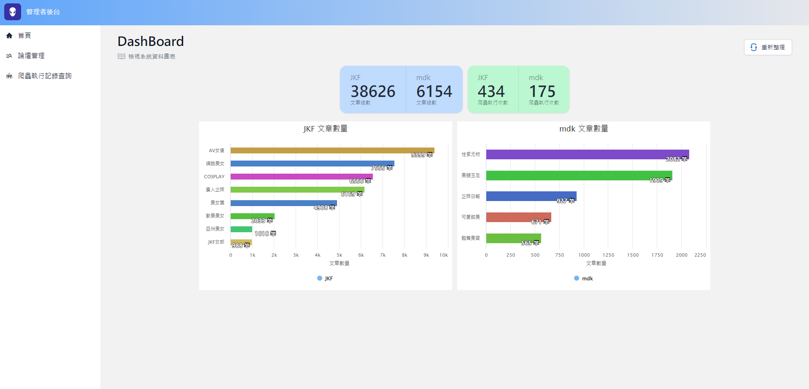

# 女神牆
> 營造一個下班舒壓的好所在
## Features
- 透過web管理頁面執行論壇爬蟲作業
- 精美的女神流水牆
- 使用``dapr`` + ``keda``擴充和開發爬蟲作業程式
- 透過論壇文章標題相似度計算，找出更多相似的文章
## 系統截圖
- > 女神流水牆
<center></center>
<br/>

- > 管理者儀表板
<center></center>
<br/>

- > 論壇管理
<center></center>
<br/>

- > 文章管理
<center></center>
<br/>

## 系統啟動方式
1. ``` docker compose up -d ```
2. 如果是第一次啟動系統，需執行下列指令，以產生系統需要用到的資料庫
``` bash
docker exec -it venus-wall_db_1 /opt/mssql-tools/bin/sqlcmd -U SA -P YourStrong!Passw0rd  -W -i init_db.sql
```

## 常用指令
``` bash
# 建立python 虛擬環境
 python -m virtualenv venv --python=python3.9.7
# execute celery worker instance 
python3.9 -m celery -A tasks worker --loglevel=info  -E
# show celery tasks
python3.9 -m celery -A tasks events
# open flower celery monitor webiste
python3.9 -m celery -A tasks flower 
# scaffold dbcontext
dotnet ef dbcontext scaffold 'Server=.,9487;Database=beauty_wall;user id=sa;password=YourStrong!Passw0rd' 'Microsoft.EntityFrameworkCore.SqlServer'  -o Models/DBModels -f -c BeautyDBContext --use-database-names --no-build --json

```
``` sql
SELECT DISTINCT A.*, ISNULL(C.MaxPage,0) AS  MaxPage FROM DBO.WebPage A
OUTER  APPLY ( SELECT TOP 1 B.Page AS MaxPage FROM DBO.Item B
WHERE B.WebPageID=A.ID
ORDER BY B.Page DESC 
)C(MaxPage)
ORDER BY MaxPage DESC

SELECT  A.*, F.Name AS ForumName,
ISNULL(C.TotalCount,0) AS  TotalCount 
FROM DBO.WebPage A
JOIN DBO.Forum F ON A.ForumID=F.ID
OUTER  APPLY ( 
SELECT COUNT(B.ID) AS TotalCount FROM DBO.Item B
WHERE B.WebPageID=A.ID
)C(TotalCount)
WHERE A.Enable=1 AND F.Enable=1
ORDER BY TotalCount DESC

--- 取出Worker LOG
SELECT  
A.ID,
A.CreateDateTime,
JSON_VALUE(A.RawData,'$.data.topic') AS Topic,
JSON_VALUE(A.RawData,'$.data.data.Name') AS Name ,
JSON_VALUE(A.RawData,'$.data.data.Url') AS Url ,
JSON_VALUE(A.RawData,'$.data.data.Start') AS Start ,
JSON_VALUE(A.RawData,'$.data.data.End') AS [End] ,
JSON_VALUE(A.RawData,'$.data.traceid') AS TraceID ,
JSON_VALUE(A.RawData,'$.data.data.ID') AS WebPageID 
FROM [beauty_wall].[dbo].[CrawlerLog] A
WHERE JSON_VALUE(A.RawData,'$.topic')='process-log' AND JSON_VALUE(A.RawData,'$.data.data.Name') IS NOT NULL
ORDER BY CreateDateTime DESC 

--- 取出資料寫入DB的LOG
SELECT  A.ID,A.CreateDateTime,
	 JSON_VALUE(A.RawData,'$.source') AS Source,
	 JSON_VALUE(A.RawData,'$.topic') AS Topic,
	 JSON_VALUE(A.RawData,'$.traceid') AS TraceID,
	 JSON_VALUE(A.RawData,'$.data.Item.Title') AS Title,
	 JSON_VALUE(A.RawData,'$.data.Item.Url') AS Url,
	 JSON_QUERY(A.RawData,'$.data.Images') AS Images,
	 B.Name AS WebPageName,
	 B.ID AS WebPageID,
	 C.Name AS ForumName,
	 C.ID AS ForumID
FROM [beauty_wall].[dbo].[CrawlerLog] A
JOIN [beauty_wall].[dbo].[WebPage] B ON JSON_VALUE(A.RawData,'$.data.Item.WebPageID')=B.ID
JOIN [beauty_wall].[dbo].[Forum] C ON B.ForumID=C.ID
```


